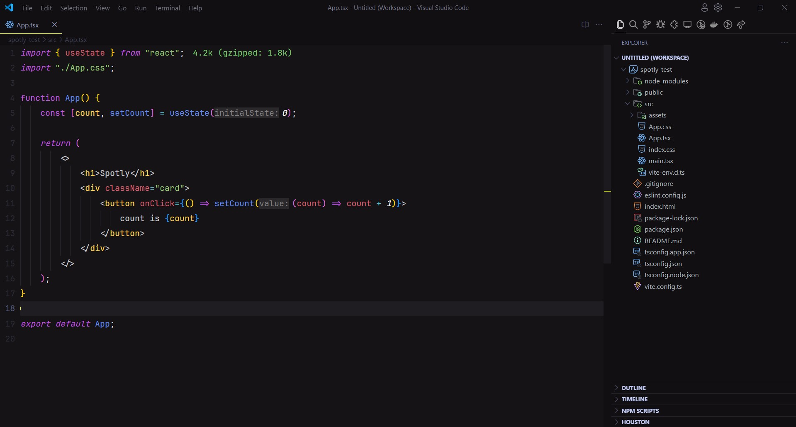
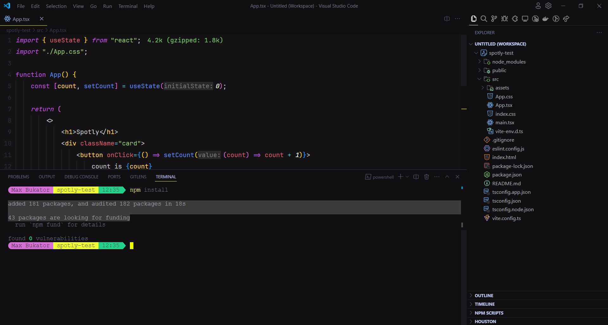

  

# Spotly Theme for [Visual Studio Code](https://marketplace.visualstudio.com/items?itemName=MaksymBukator.spotly)

Spotly is a clean, minimalist VS Code theme designed to enhance your coding experience. It offers optimized color palettes for improved readability and visual comfort.

## Screenshots:

### Dark Theme

#### Editor Colors

#### Terminal Colors

#### Tabs and Widgets Colors

### Light Theme

#### Editor Colors

#### Terminal Colors

#### Tabs and Widgets Colors

## Key Features:

-   Clean and Minimalist Design: A distraction-free environment.
-   Enhanced Readability: Optimized color palette for code clarity.
-   Customizable: Easily adjust the theme's appearance.
-   High Contrast (Under development): Clear distinction between code elements.
-   Dark and Light: Choose the mode that suits you.

## Installation:

1. Open the VS Code Marketplace: `Ctrl+Shift+X` (Windows/Linux) or `Cmd+Shift+X` (macOS)
2. In search bar type "Spotly".
3. Install the Theme: Click the "Install" button.

## Usage:

1. Press `Ctrl+Shift+P` (Windows/Linux) or `Cmd+Shift+P` (macOS)
2. In search bar type "Preferences: Color Theme" and press `Enter`.
3. In appeared list look for "Spotly" theme or just type it in search bar.
4. When you found "Spotly" theme press `Enter` and choose between two variants (Light/Dark) of our theme to your heart

## Customization:

While Spotly offers a well-balanced default configuration, you can further customize it:

1. Go to Menu Bar, click on File > Preferences > Settings.
2. Search for "editor.tokenColorCustomizations".
3. Click on "Edit in settings.json"

or

1. Press `Ctrl+Shift+P` (Windows/Linux) or `Cmd+Shift+P` (macOS)
2. Type "Preferences: Open User Settings (JSON)".
3. Press `Enter`

Now you can start changing colors using [this documentation for Visual Studio Code](https://code.visualstudio.com/api/references/theme-color) or to reference one of the [theme json file](themes/) for more accurate token colors customization

## Contributing:

Feel free to fork the repository and submit a pull request. Your contributions are welcome!

## Changes

Are you wondering what has been added in the latest version? You can see it in the [CHANGELOG](/CHANGELOG.md) file in the root directory of this source tree.

## License:

This source code is licensed under the [MIT license](https://mit-license.org) found in the [LICENSE](/LICENSE) file in the root directory of this source tree.
